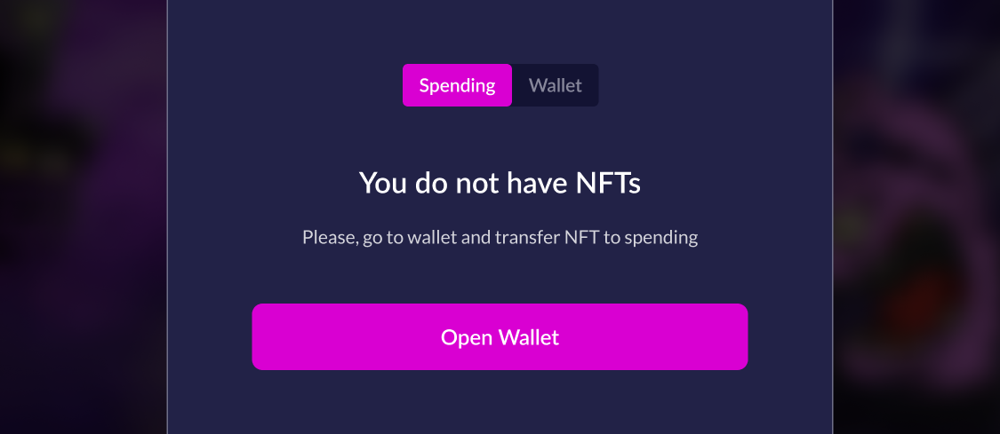
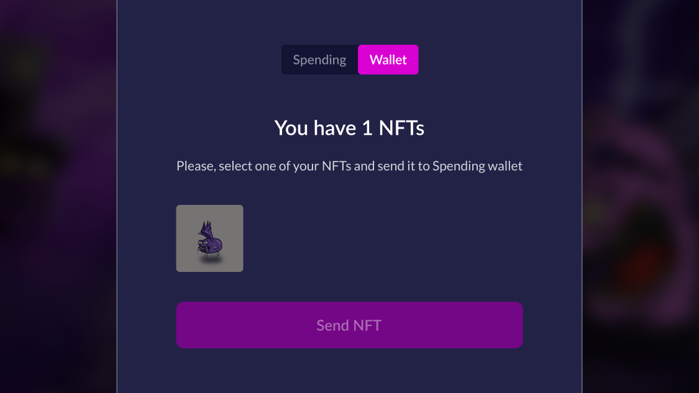
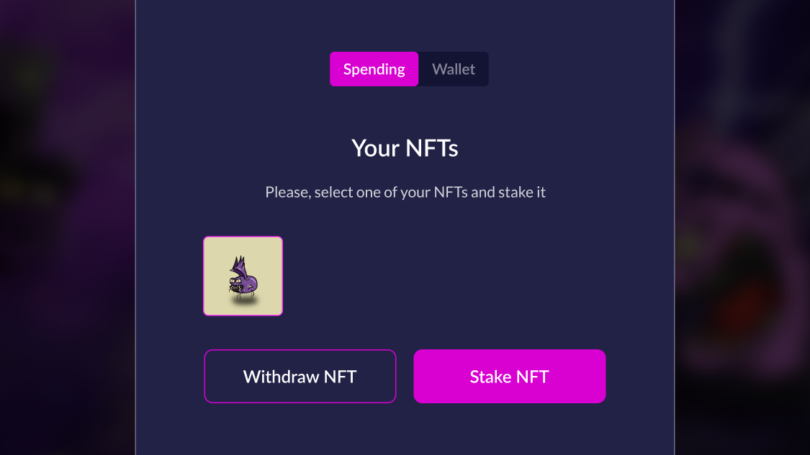
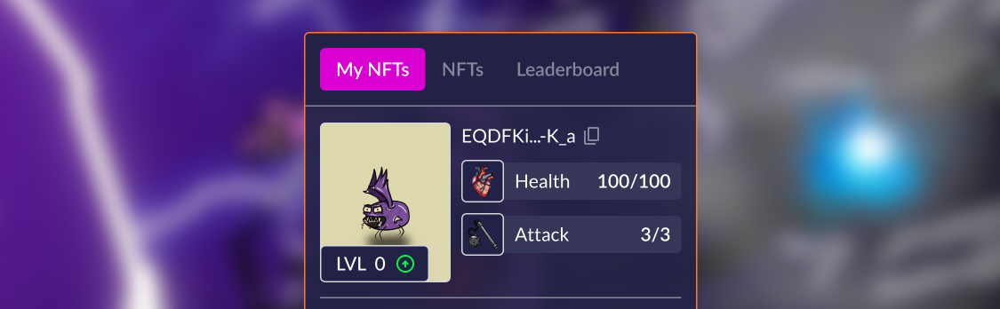

# How to stake NFT in the game?
1. Click "Stake" in the center of the page:

2. You will see a window with tabs "Spending" and "Wallet":


If you have NFTs on "Spending" go to step 6.


3. Switch to the "Wallet" and select an NFT to send to "Spending". Click "Send NFT":

4. Confirm the transaction on the website and in your wallet; 
5. After the transaction is confirmed (1-2 minutes), switch back to Spending;
6. Select the NFT to lock it for the duration of the Siege:

**Ready!** The game will start immediately after investing in one of the Factions.
