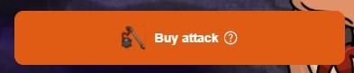
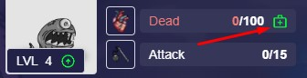

# How to become an Investor in the game?
Everyone becomes an investor (including players with NFT) who has done at least one of the following actions:
* Increase the Faction's attack for {{tt}} ("Buy Attack" button):\

* Revive a dead NFT character (your own or someone else's), click on the button with the image of a first aid kit:\

* Boost up your character's level up progress:\

You can learn more about the mechanics and rewards in [Investors](https://TBD.com)