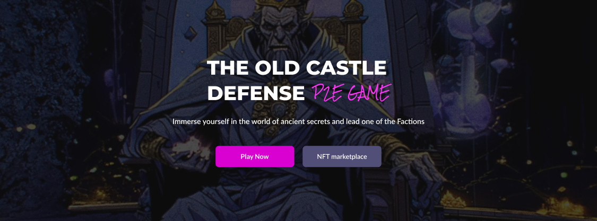
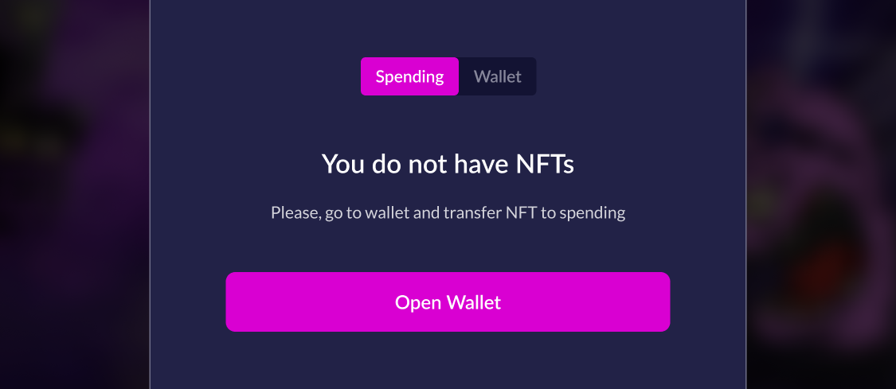
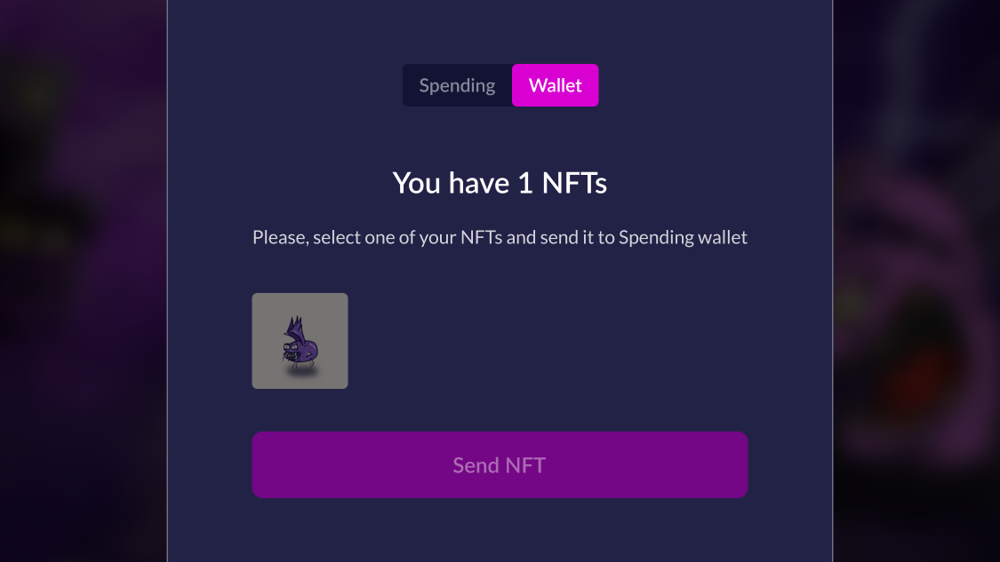
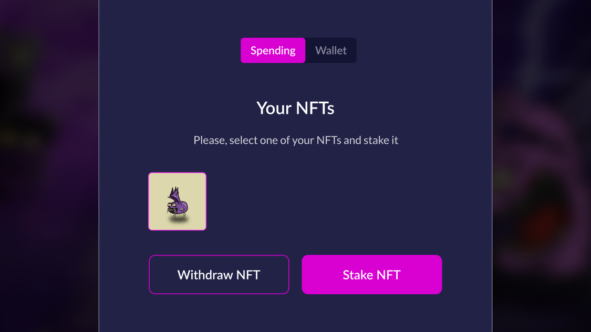
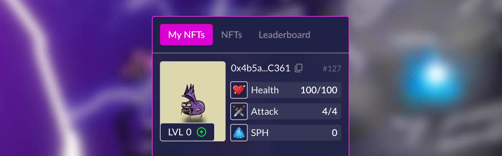

# 🚀 How to start playing

## Warriors (NFT owners)

If you are an NFT owner, you can play without any investments. You need to stake NFT 
in an active Siege, upgrade, and heal to increase abilities to earn more rewards than 
your teammates. Read more in [Game-Fi Elements](http://TBD.com).


[terrible-creatures.md](nft-collections/terrible-creatures.md)



[knights-of-the-kingdom.md](nft-collections/knights-of-the-kingdom.md)



**How to get NFT:** You can get NFT from Mystery Box. What is it and how to get it, read 
more in [Mystery Boxes](http://TBD.com).


### NFT staking
1. Visit the game [website (https://theoldcastle.xyz/)](https://theoldcastle.xyz/);
2. Click "Connect Wallet" in the upper right corner and connect your Wallet:

<figure><figcaption></figcaption></figure>

3. When the game is ready to start, you will see the "Participate" button on the Home page. 
Click to go to the Siege page:

<figure><figcaption></figcaption></figure>

4. Click "Stake" in the center of the page:

<figure><figcaption></figcaption></figure>

5. You will see a window with tabs "Spending" and "Wallet":

<figure><figcaption></figcaption></figure>


If you have NFTs on "Spending" go to step 9.


6. Switch to the "Wallet" and select an NFT to send to "Spending". Click "Send NFT":

<figure><figcaption></figcaption></figure>

7. Confirm the transaction on the website and in your wallet;
8. After the transaction is confirmed (1-2 minutes), switch back to Spending;
9. Select the NFT to lock it for the duration of the Siege:

<figure><figcaption></figcaption></figure>

**Ready!** The game will start immediately after investing in one of the Factions.

<figure><figcaption></figcaption></figure>

***

## Investors ({{tt}} holders)
You can stake **{{tt}}** in the Faction's treasury pool and increase its attack power. 
The more and earlier you stake **{{tt}}**, the more reward you will receive once the 
Faction wins the Siege. Read more:


[investors.md](investors.md)


### The first investment
1. Visit the game [website https://theoldcastle.xyz/](https://theoldcastle.xyz/);
2. Click "Connect Wallet" in the upper right corner and connect your Wallet:

<figure><figcaption></figcaption></figure>

3. When the game is ready to start, you will see the "Participate" button on the Home page. 
Click to go to the Siege page:

<figure><figcaption></figcaption></figure>

4. Click the "Buy attack" button under the window of one of the Factions:

<figure><figcaption></figcaption></figure>

5. Choose the right number of attack boost levels and click the "Buy" button:

<figure><figcaption></figcaption></figure>

6. Confirm the transaction on the website and in your wallet;

**Ready!** After the transaction is confirmed (1-2 minutes), the Faction's attack will be increased.

<figure><figcaption></figcaption></figure>