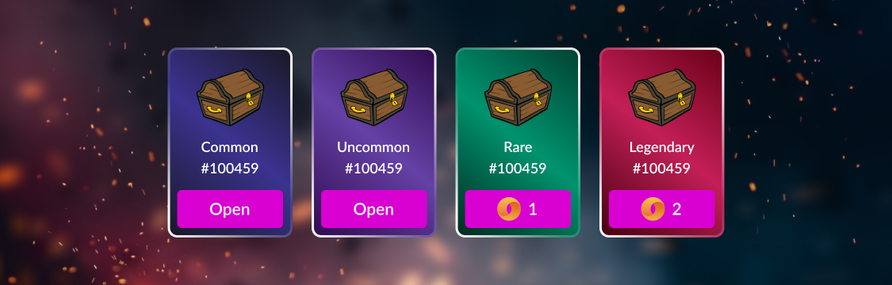

# 🎁 Mystery Boxes

<figure><figcaption></figcaption></figure>


If you have already opened all the starter Mystery Boxes, don't forget to check for new ones. 
New Mystery Boxes can be obtained during community events.


After connecting the wallet, each user has access to 
the [Mystery Boxes](https://theoldcastle.xyz/{{bn}}/{{tt}}/mysterybox). Each Mystery Box contains various 
types of rewards such as NFT, Treasury Tokens, and Sapphires.


If you do not have Mystery Box, it's time to do something. You need to support all activities of The 
Old Castle Defense in Socials or [invite new friends](decentralized-referral-system-drs.md).


The reward defines randomly, according to the following constraints:
1. **Number of rewards:** from 1 to 3
2. **Number of SPH:** from 1 to 20

<table>
  <thead>
    <tr>
      <th width="220">QUALITY</th>
      <th width="220">NFT</th>
      <th width="220">{{tt}}</th>
      <th width="220">$SPH</th>
    </tr>
  </thead>
  <tbody>
    <tr>
      <td><mark style="color:blue;">Common</mark></td>
      <td>0.15%</td>
      <td>0</td>
      <td>99.85%</td>
    </tr>
    <tr>
      <td><mark style="color:purple;">Uncommon</mark></td>
      <td>1%</td>
      <td>25%</td>
      <td>74%</td>
    </tr>
    <tr>
      <td><mark style="color:green;">Rare</mark></td>
      <td>5%</td>
      <td>35%</td>
      <td>60%</td>
    </tr>
    <tr>
      <td><mark style="color:red;">Legendary</mark> </td>
      <td>10%</td>
      <td>50%</td>
      <td>40%</td>
    </tr>
  </tbody>
</table>


50% of all paid Mystery Boxes goes back to Mystery Boxes pool. 
Example: the price to open Common Mystery Box = $1. It means that $0.5 will go back to Mystery Boxes 
treasury, and you will receive more in the next opening.\
Bank addresses:
* TBD;



You can acquire an additional Mystery Box only after opening the previous one, resulting in a total 
of 4 Mystery Boxes.
