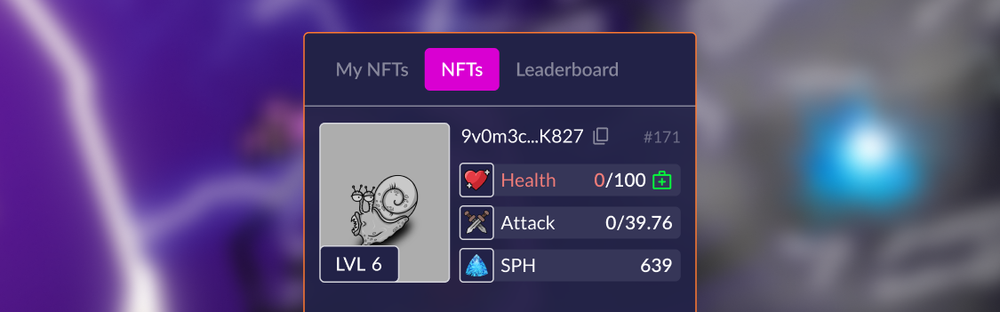

# How to become an Investor in the game?

Everyone becomes an investor (including players with NFT) who has done at least one of the following actions:

* Increase the Faction's attack for {{tt}} ("Buy Attack" button):

<figure><figcaption></figcaption></figure>

* Revive a dead NFT character (your own or someone else's), click on the button with the image of a first aid kit:

<figure><figcaption></figcaption></figure>

* Boost up your character's level up progress:

You can learn more about the mechanics and rewards in the article "Investors":


[investors.md](../investors.md)



