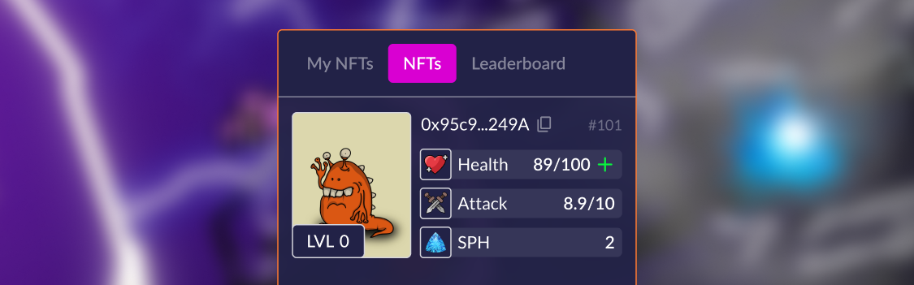

# How to heal NFT?

Click on the button with the green "**+**" symbol on the character image:

<figure><figcaption></figcaption></figure>

A confirmation window will appear. The cost of treatment is affected by the number of health points 
spent by the character and the number of team defeats, you can find out more in the 
section Game-Fi Elements.


[game-fi-elements.md](../game-fi-elements.md)





