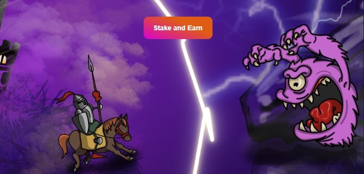

# How to start the game?

The game starts when two NFTs, on both sides, are blocked for the game.&#x20;

If you are the owner of the gaming NFT, go to [The Old Castle](https://theoldcastle.xyz/#/) and click the "Participate" button:

<figure><figcaption></figcaption></figure>

Then click the "Stake" button:

<figure><figcaption></figcaption></figure>

Select the NFT to play and click "Stake NFT":

<figure><figcaption></figcaption></figure>

Useful articles:


[how-to-buy-nft-for-the-game.md](how-to-buy-nft-for-the-game.md)



[how-to-stake-nft-in-the-game.md](how-to-stake-nft-in-the-game.md)


Ready! You have locked the NFT and are ready to play.
