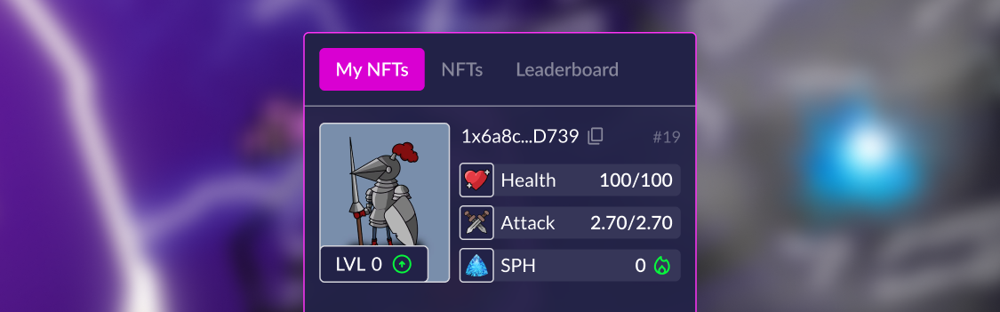

# How to upgrade NFT?

Click on the button with the green arrow up on the character image:

<figure><figcaption></figcaption></figure>

A confirmation window will appear. The cost of raising the level is affected by the current level of 
the character. You can speed up the level increased by spending {{tt}}, more information can be found in 
the section Game-Fi Elements.


[game-fi-elements.md](../game-fi-elements.md)



The price includes a service commission of 6%. After deducting the commission, the {{tt}} invested by the 
participants is collected in the treasury. After the victory of your Faction, the invested funds will be 
returned and a reward will be awarded.





